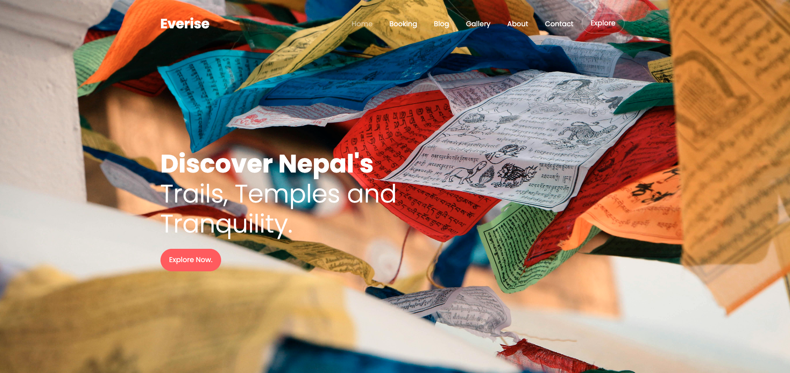
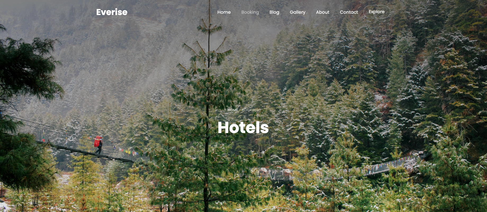
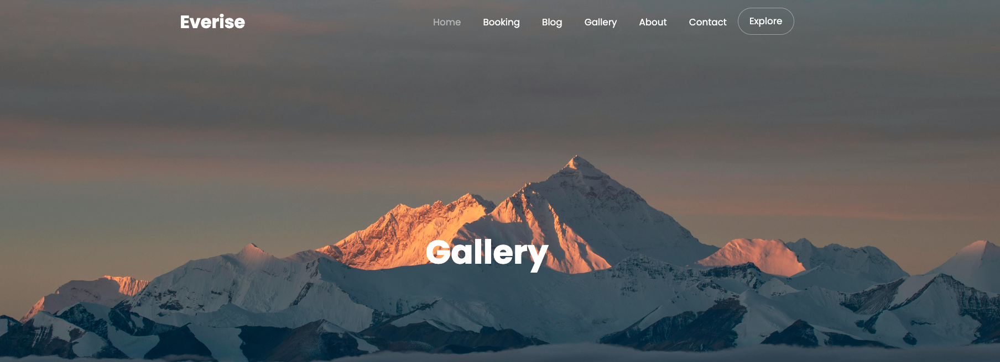
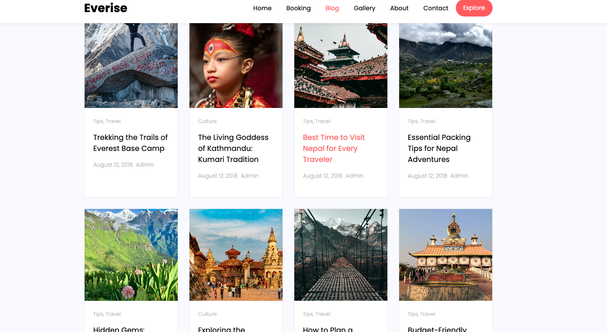

# Nepal Tourism Website

## Project Description
Our Nepal Tourism Website is a collaborative project by three passionate developers, designed to showcase the beauty and culture of Nepal while offering travelers a seamless experience in booking tours and guide packages. The main goal of this platform is to allow users to explore, plan, and purchase travel packages while enjoying our top-notch hospitality.

The website includes:
- **Homepage:** A welcoming overview of our services and featured tours.
- **About Page:** Information about our team and mission.
- **Blog Page:** Articles and travel tips to inspire and guide visitors.
- **Contact Page:** A form and contact information to connect with us easily.
- **Booking Page:** Allows users to select and purchase tour packages online.
- **Gallery:** Visual showcase of Nepal’s landscapes, attractions, and past tours.

Technologies used: **HTML, CSS, Bootstrap, JavaScript, jQuery**.

---

## Setup Instructions

1. **Clone the repository:**

    git clone https://github.com/Rizen-Shrestha/Everise.git

2. **Navigate into the project folder:**
    cd Everise

3. **Open the website in the browser:**
- Open `index.html` in your favorite browser.  
- No server setup is required since it’s a static website.

---

## Contributors
- [Aashraya Belbase](https://github.com/ShininDark)  
- [Rizen Shrestha](https://github.com/Rizen-Shrestha)  
- [Suvham Shakya](https://github.com/Complex85362)  

---

## Screenshots
### Homepage

### Booking Page

### Gallery

### Blog

